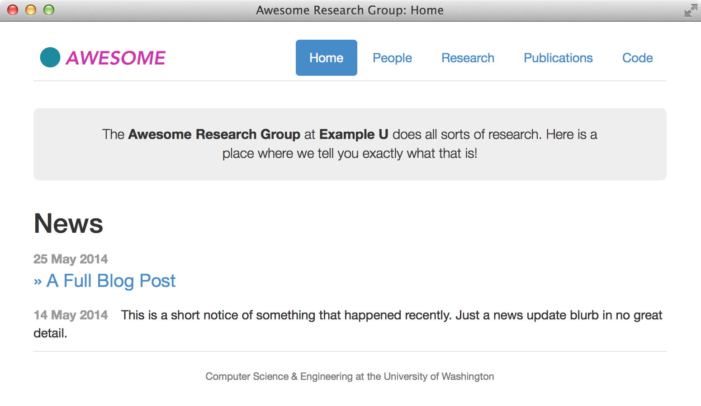

Research Group Web Site Template
================================

This is a [Jekyll][]-based Web site intended for research groups. Your group should be able to get up and running with minimal fuss.

This project originated at the University of Washington.  You can see the machinery working live at [our site][sampa].

This work is licensed under a [Creative Commons Attribution-NonCommercial 4.0 International License][license].

[sampa]: http://sampa.cs.washington.edu/
[license]: https://creativecommons.org/licenses/by-nc/4.0/

Features
--------

* Thanks to [Jekyll][], content is just text files. So even faculty should be able to figure it out.
* Publications list generated from BibTeX.
* Personnel list. Organize your professors, students, staff, and alumni.
* Combined news stream and blog posts.
* Easily extensible navigation bar.
* Responsive (mobile-ready) design based on [Bootstrap][].

[Bootstrap]: http://getbootstrap.com/

Setup
-----

1. Install the dependencies. You will need [Python][], [Pybtex][] (`pip install pybtex`), and [Jekyll][] (`gem install jekyll`).
2. [Fork][] this repository on GitHub.
3. Clone the fork (along with its submodules) to your own machine: `git clone --recursive git@github.com:yourgroup/research-group-web.git`.
4. Add an "upstream" remote for the original repository so you can stay abreast of bugfixes: `git remote add upstream git://github.com/uwsampa/research-group-web.git`.
5. Customize. Start with the `_config.yml` file, where you enter the name of the site and its URL.
6. Type `make` to build the site and then run `jekyll serve -w` to view your site.
7. Keep adding content. See below for instructions for each of the various sections.
8. Periodically pull from the upstream repository: `git pull upstream master`.

[Python]: https://www.python.org/
[Fork]: https://github.com/uwsampa/research-group-web/fork

Publication List
----------------

The list of publications is in `bib/pubs.bib`. Typing `make` will generate `pubs.html`, which contains a pretty, sorted HTML-formatted list of papers. The public page, `publications.html`, also has a link to download the original BibTeX.

News Items and Blog Posts
-------------------------

For both long-form blog posts and short news updates, we use Jekyll's blogging system. To post a new item of either type, you create a file in the `_posts` directory using the naming convention `YYYY-MM-DD-title-for-url.md`. The date part of the filename always matters; the title part is currently only used for full blog posts (but is still required for news updates).

The file must begin with [YAML front matter][yfm]. For news updates, use this:

    ---
    layout: post
    shortnews: true
    ---

For full blog posts, use this format:

    ---
    layout: post
    title:  "Some Great Title Here"
    ---

And concoct a page title for your post. The body of the post goes after the `---` in either case.

[yfm]: http://jekyllrb.com/docs/frontmatter/

Personnel
---------

People are listed in a [YAML][] file in `_data/people.yml`. You can list the name, link, bio, and role of each person. Roles (e.g., "Faculty", "Staff", and "Students") are defined in `_config.yml`.

[YAML]: https://en.wikipedia.org/wiki/YAML

Building
--------

The requirements for building the site are:

* [Jekyll][]: run `gem install jekyll`
* [Pybtex][]: run `pip install pybtex`
* [bibble][]: included as a submodule. Because git is cruel, you need to use
  `git clone --recursive URL` or issue the commands `git submodule init ; git
  submodule update` to check out the dependency.
* ssh and rsync, only if you want to deploy directly.

`make` compiles the bibliography and the website content to the `_site`
directory. To preview the site, run `jekyll serve`` and head to
http://0.0.0.0:4000.

Deploying to Your Sever
-----------------------

To set up deployments, edit the Makefile and look for the lines where `HOST` and `DIR` are defined. Change these to the host where your HTML files should be copied to.

To upload a new version of the site via rsync over ssh, type `make deploy`. A web hook does this automatically when you push to GitHub. Be aware that the Makefile is configured to have rsync delete stray files from the destination directory.

[Jekyll]: http://jekyllrb.com/
[bibble]: https://github.com/sampsyo/bibble/
[pybtex]: http://pybtex.sourceforge.net
