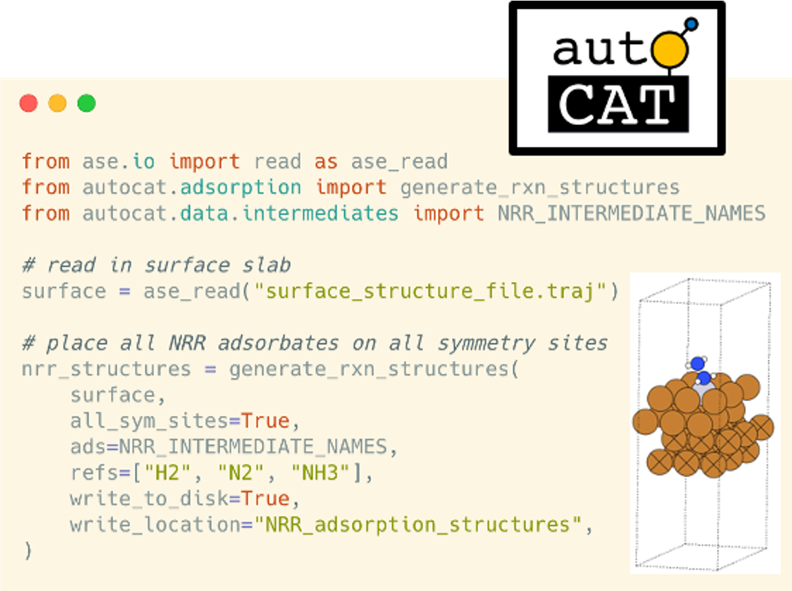
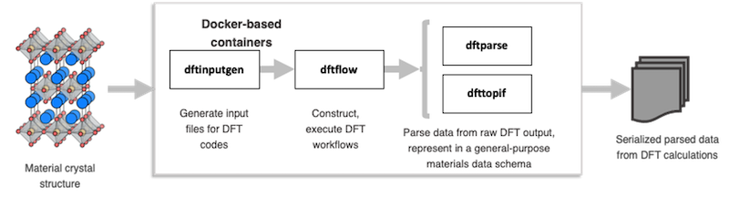

With `AutoCat`, DFT-ready structures for heterogeneous catalysis studies (i.e., different surface terminations of crystalline solids along with the various adsorbed reaction intermediate moeities) can be generated in an automated fashion. Optionally, `AutoCat` writes these crystal structures to disk, organizing them into a standardized directory structure to ensure easy, systematized access and enable a uniform interface with `DFT-in-the-Cloud` software. Materials classes supported include mono-element slabs, single-atom alloys, and multi-principal element alloys (a.k.a high-entropy alloys). Defaults are available for the common electrocatalysis reactions in oxygen and nitrogen reduction. (To be open-sourced)

`DFT-in-the-Cloud` is a modular, extensible framework of open-source `Python` tools for on-demand DFT calculations. The packages within this ecosystem support multiple popular DFT softwares including `Quantum Espresso`, `VASP`, and `GPAW` (in development). In this project, we interface the `DFT-in-the-Cloud` tools with `FireWorks`, a computational job/workflow management software, and the combined setup can be packaged into containers (e.g., Docker-based) for complete reproducibility. The individual packages within this ecosystem are:

- [`dftinputgen`](https://github.com/CitrineInformatics/dft-input-gen): generate input files for DFT codes
- [`dftparse`](https://github.com/CitrineInformatics/dftparse): parse data from raw DFT output files
- [`dfttopif`](https://github.com/CitrineInformatics/pif-dft): parse data from raw DFT output files into the Physical Information File (PIF) format, a general-purpose materials data schema
- [`pypif`](https://github.com/CitrineInformatics/pypif): interact with data in the PIF format
- `dftflow`: construct and execute DFT calculation workflows (To be open sourced)

For the ongoing development of these packages to support `GPAW` for this project, see the forks on GitHub repositories [here](https://github.com/aced-differentiate)

